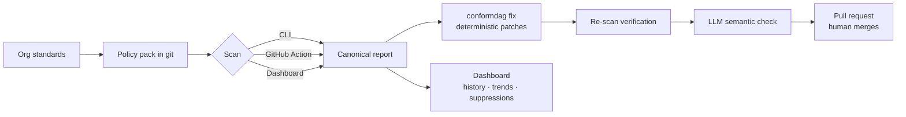

# ConformDAG

**Enforce your organization's Airflow engineering standards** — as versioned
policy packs, with deterministic verification, verified fixes, and a
self-hosted governance server.

Every scan is offline and non-executing by default. One scan engine produces
one versioned JSON report; terminal, SARIF, and self-contained HTML are
projections of it.

## How it works



## The four surfaces

| Surface | Command | What it does |
|---|---|---|
| **Scan** | `conformdag scan` | Evaluates policy packs; emits the canonical report with machine-readable remediation payloads |
| **Fix** | `conformdag fix` | Proposes deterministic patches, verifies by re-scan, writes only verified patches |
| **Agent** | `conformdag agent run` | Triages findings, fixes, verifies semantically, opens a PR — never merges |
| **Platform** | `conformdag serve` + `conformdag worker` | Self-hosted governance: findings history, trends, suppression management, durable scans |

Plus a **GitHub Action** for blocking CI scans with SARIF.

## Quick start

Requires Python 3.12 (with [mise](https://mise.jdx.dev/) managing Python and uv):

```bash
mise use python@3.12 uv@0.12.0
uvx --from conformdag==1.0.0b1 conformdag version
```

Scan any Airflow repository with the bundled **community** pack — no setup:

```bash
uvx --from conformdag==1.0.0b1 conformdag scan \
  --path /path/to/airflow/dags \
  --policy-pack community \
  --format terminal
```

Fix findings — dry run prints the diff; `--apply` writes only re-scan-verified
patches:

```bash
uvx --from conformdag==1.0.0b1 conformdag fix --path .
uvx --from conformdag==1.0.0b1 conformdag fix --path . --apply
```

### Agentic pull requests

Configure an OpenAI-compatible endpoint and a GitHub App installation token,
then let the agent open human-merged PRs:

```bash
export CONFORMDAG_AGENT_BASE_URL="https://your-endpoint.example/v1"
export CONFORMDAG_AGENT_MODEL="your-model"
export CONFORMDAG_MODEL_API_KEY="..."
export CONFORMDAG_GITHUB_TOKEN="..."
export CONFORMDAG_GITHUB_REPO="owner/repo"
uvx --from conformdag==1.0.0b1 conformdag agent run --path . --open-pr
```

Safety model: deterministic triage and generation, strict verifier verdicts
(reject/escalate block the PR), credential redaction before any model call.
Details in the [user guide](docs/user-guide.md#agentic-fix-loop).

### CI enforcement

```yaml
- uses: parthmule28/conformdag@v1.0.0-beta.1
  with:
    policy-pack: community   # a path, or a git URL pulled with pack pull
```

### The governance platform

```bash
export CONFORMDAG_PLATFORM_TOKEN="$(openssl rand -hex 32)"
export CONFORMDAG_WORKSPACE_DIR="$HOME/conformdag-platform"
docker compose -f deploy/docker-compose.yml up -d
```

Dashboard, findings history, trends, suppression management. Full instructions
in the [platform deploy guide](docs/platform-deploy.md).

## Organization packs are the product

The `community` pack is a try-now path. Production governance runs on **your**
pack in git: stable policy IDs with provenance, versioned contracts, expiring
exceptions, and a central policy repo consumed by DAG repositories.

```bash
uvx --from conformdag==1.0.0b1 conformdag init
uvx --from conformdag==1.0.0b1 conformdag validate-policies --path policies/pack.yaml
uvx --from conformdag==1.0.0b1 conformdag pack pull <your-pack-git-url>
```

## Honest limitations

- Semantic and agent evaluation are integration-verified, not
  accuracy-baselined: the public benchmark has no redistributable labelled
  corpus. The deterministic and round-trip gates are the accuracy-neutral floor.
- The dashboard has no multi-user RBAC; single-admin auth only.
- No maintained Airflow 2.x runtime image; supply your own digest-pinned image
  via `--runtime-image`.
- dbt support, OCI policy bundles, SSO pack download, and RBAC are post-1.0.
  MCP for IDE agents is the first v1.x follow-up.

## Development

```bash
mise install
mise run setup
mise run check
```

See the [user guide](docs/user-guide.md) for operational usage, the
[architecture](docs/architecture.md) for trust boundaries and data flow, the
[platform deploy guide](docs/platform-deploy.md) for the team server, and the
[release checklist](docs/release.md) for publication evidence.

## License

Apache-2.0. See [LICENSE](LICENSE).
